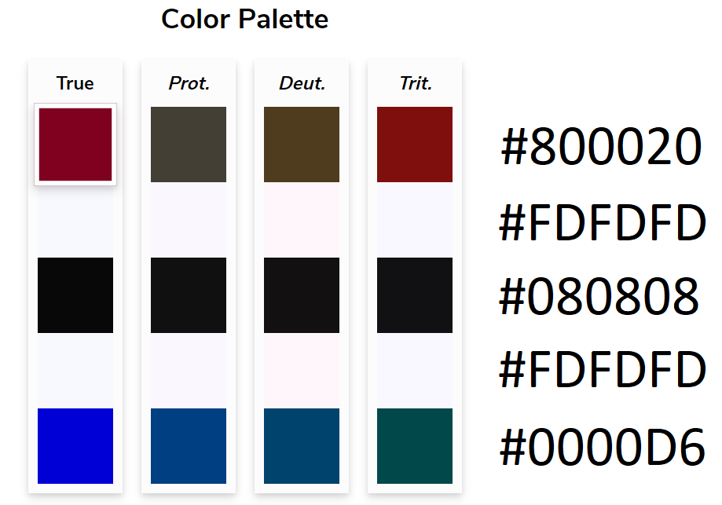

# Teaching Interview - University of Edinburgh
This repository contains the materials requested for my teaching interview at the University of Edinburgh, 8th March 2021.

## Direct links
The learning material for this lecture comprises:

- slides (PDF | HTML | RMD)
- video (MP4 | ...)
- closed captions (SRT)
- transcript (TXT).

## Accessibility
[Colour vision deficiency](https://www.nhs.uk/conditions/colour-vision-deficiency/) (CVD) is a relatively prevalent condition (the NHS estimates in ~4.5% the proportion of British population affected by some form of it). While a second-year class at a Scottish university is likely be more diverse than the general population, we cannot rule out that some students might have congenital difficulties in distinguishing colours.

Therefore, I have picked the colour palette for these slides according to accessibilty criteria. Specifically, only four colours were used, which were selected to meet the [WebAIM contrast checker criteria](https://webaim.org/resources/contrastchecker/) and such that they were clearly distinguishable in the presence of the least rare types of CVD (protanopia, deuteranopia, tritanopia). I tested for the latter using a [simulation tool](https://davidmathlogic.com/colorblind/#%23800020-%23F8F8FF-%23080808-%23F8F8FF-%230000D6) that would allow me to compare colours across conditions and side by side. Moreover, I have used the "structurebold" font-theme from RMarkdown: the text typeface is clean and straight, the font is sans-serif, and I left the sizes at their the default.

Contrast check:
WCAG Level AA pass: Normal Text, Large Text, Graphical Objects and User Interface Components.
WCAG Level AAA pass: Normal Text, Large Text.

CVD check:

## Software and license
The recording was realised using [OBS 26.1.1](https://obsproject.com/), with the video feed going through a trial version of [XSplit Vcam](https://www.xsplit.com/vcam) for background removal. This material is released under the [GNU Free Documentation License](https://www.gnu.org/licenses/fdl-1.3.html), Version 1.3.
